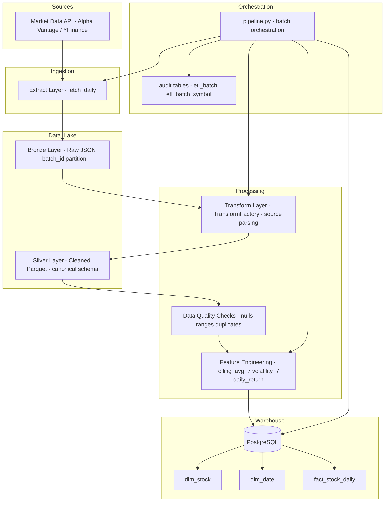

# 📦 Financial Market Data Pipeline

Educational mini data engineering project implementing a local ETL pipeline with:

- Medallion architecture (Bronze / Silver / Gold)
- Star schema modeling
- PostgreSQL warehouse
- Docker-based environment
- Batch orchestration with audit tables
- Retry + exponential backoff
- Window refresh strategy
- Crash recovery semantics

---

# 🎯 Project Goal

Build a production-like batch data pipeline that:

1. Fetches financial market data from Alpha Vantage API
2. Stores raw immutable data (Bronze)
3. Transforms data into analytical format (Silver)
4. Loads into PostgreSQL warehouse (Gold)
5. Tracks execution with audit tables
6. Handles failures, retries, and rate limits

This project is designed as a learning path toward becoming a Data Engineer.

---

# 🏗 Architecture Overview

## Architecture

---

# 🥉 Bronze Layer

- Raw JSON files
- Immutable
- One file per symbol per batch
- Stored in `data/bronze/`

Purpose:
- Auditability
- Reprocessing
- Debugging
- Reproducibility

---

# 🥈 Silver Layer

- In-memory transformation using pandas
- Type casting
- Derived metrics:
  - daily_return
  - rolling_avg_7
  - volatility_7
- NaN → None conversion for SQL compatibility

---

# 🥇 Gold Layer (PostgreSQL)

Star schema:

- dim_stock
- dim_date
- fact_stock_daily

Patterns implemented:

- Surrogate keys
- Natural keys
- COPY bulk load
- Staging table
- Idempotent inserts (ON CONFLICT)
- Window refresh strategy (7-day rolling recalculation)

---

# 📊 Audit & Batch Tracking

Tables:

- etl_batch
- etl_batch_symbol

Features:

- Batch UUID isolation
- Symbol-level status tracking
- SUCCESS / FAILED / PARTIAL_SUCCESS
- Automatic RUNNING → FAILED recovery
- total_rows_loaded aggregation from DB
- finished_at timestamp

---

# 🔁 Retry & Backoff

Extract layer implements:

- Transient error detection
- Exponential backoff retry
- Configurable retry parameters via `.env`

Environment variables:

MAX_RETRIES=3
BASE_DELAY=2
MIN_SYMBOL_DELAY=1.2

---

# 🐳 Docker Setup

## Build

docker compose build

## Run Pipeline

docker compose run pipeline python src/job_runner.py AAPL TSLA

## Clean up

docker compose down --remove-orphans

---

# ⚙️ Configuration

Configuration is injected via `.env` and **not baked into the image**.

Follows 12-factor app principles.

---

# 🧠 Concepts Covered

- OLTP vs OLAP
- MVCC basics
- Star schema modeling
- Medallion architecture
- Idempotency
- Bulk loading
- Transaction boundaries
- Retry strategies
- Rate limiting
- Recovery semantics
- Separation of concerns
- Dockerized environments

---

# 🚀 Future Improvements

- ThreadPool parallel execution
- Airflow integration
- Incremental load by watermark
- Structured logging (JSON logs)
- Metrics (Prometheus)
- CI/CD integration
- S3-based Bronze layer

---

# 📌 Author

Radek Kulig  
Learning path toward Data Engineering 🚀
